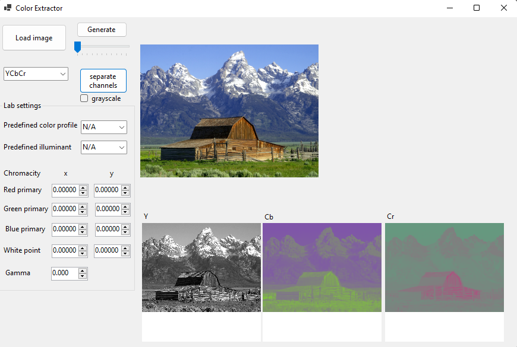

# ColorExtractor
Conversions from RGB to different color spaces. 
## Example
A color image and its Y, Cb and Cr components.

## Supported color spaces
The program allows for conversions from RGB to the following color spaces:
* [YCbCr](https://en.wikipedia.org/wiki/YCbCr),
* [HSV](https://en.wikipedia.org/wiki/HSL_and_HSV),
* [Lab](https://en.wikipedia.org/wiki/CIELAB_color_space) with user-defined color profile (the user can also choose a color space from the list of well-known color spaces such as sRGB or Adobe RGB).
